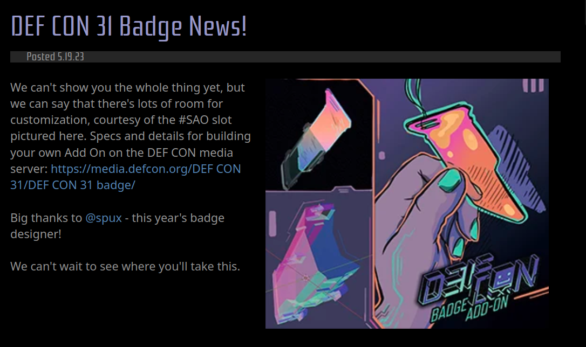

# Defcon31 addon badge

Following this announcement I've decided to make myself a simple "draw my badge" app that'd be hosted over a WiFi access point. The main challenge was the size restriction. It had to fit something within roughly 50mm x 30mm.

## Hardware

- A [Raspberry Pi Pico W](https://www.amazon.ca/dp/B0B5SB8XHV?ref=ppx_yo2ov_dt_b_product_details&th=1) (20$)
- A [WayinTop 0.91" OLED Display](https://www.amazon.ca/dp/B085NHM5TC?psc=1&ref=ppx_yo2ov_dt_b_product_details) (7$)
- A [2x AA Battery holder](https://www.amazon.ca/dp/B076C7S2VN?psc=1&ref=ppx_yo2ov_dt_b_product_details) (3$)

<!-- TODO: add pic of hardware-->

## Firmware setup

I'm using [FreeRTOS](https://github.com/FreeRTOS/FreeRTOS) with the [Pico SDK](https://github.com/raspberrypi/pico-sdk).

## Software

<!-- TODO: fill this in-->